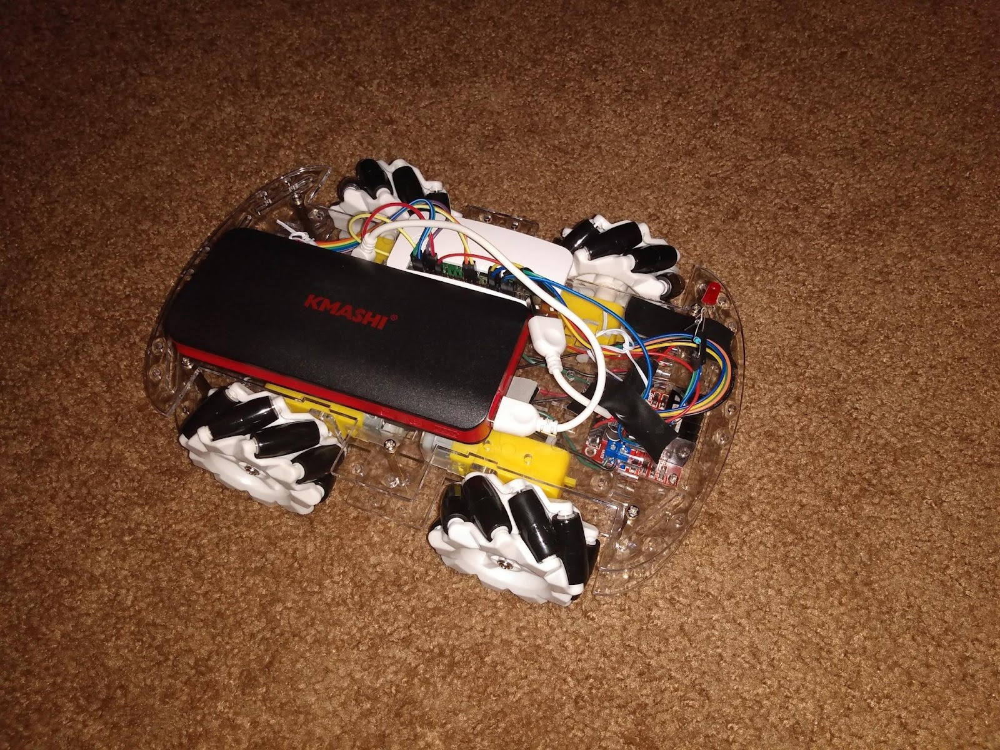
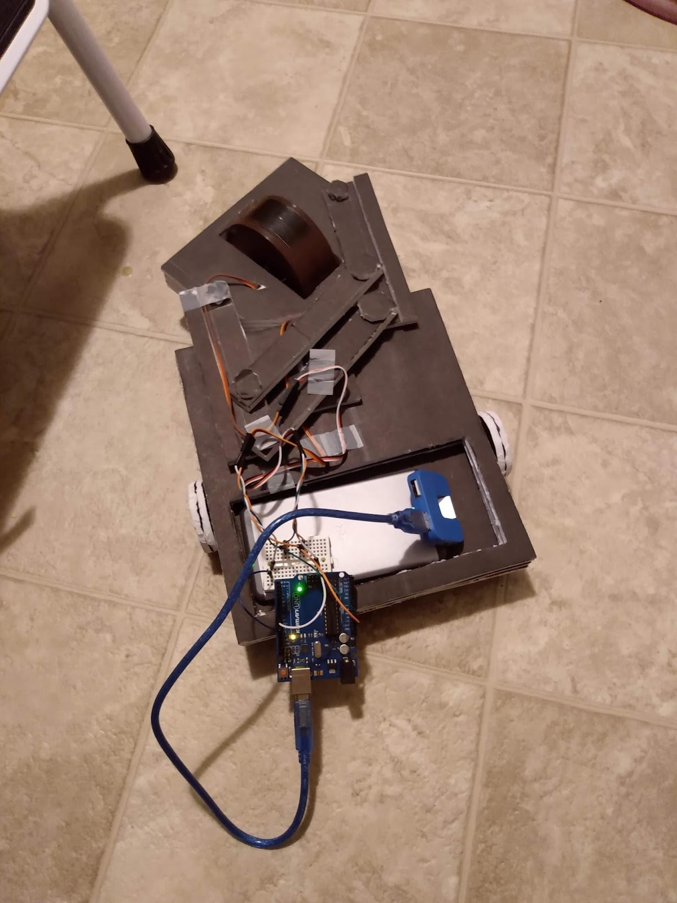
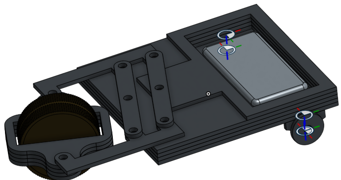

# Status of the Robot Car

## Overview

I had the idea to be able to control a robot car from my phone, computer, or something else. At first the goal of this project was to spend a little money as possible and use parts that I already had (I was a student in Electrical Engineering so I felt that I had sufficient from all the electronics acquired in various course projects). I have since learned that my current inventory wouldn't work. The project has turned into something more that will hopefully include the following aspects in time.

1. Controls - I want to have an IMU that will be the main sensor in the control system to allow the car direction to accurate. With the current setup there is no feedback so the dead reckoning doesn't go very strait.
1. PCB design - The chassis I bought off amazon doesn't have very much space so I would like to design a board to take place of the messy electronics I have in the prototype.
1. Mobile App - I intend for the final product to be usable to the common consumer so I would like to make the car controllable from a smart phone app. That way the user won't have to use any other fancy hardware to use it.

## Mecanum Chassis with 7.2V NiMH Battery

### Improvements

1. The 7.2 volt battery is the main improvement here. I didn't go for 12 V most of my voltage regulators (Onboard the Arduino and separate board for RPi) are rated for a max of 12 V and a fully charged 12 volt battery is more than 12 volts. The fully charged 7.2 volt battery charges to about 8.4 volts. Therefore, with the 2 volt drop across the motor controllers the motor voltage is right around the rated 6 volts.
1. Programmed to work with an IR remote. This is a definite improvement to the terminal interface control.

### Issues

1. I don't have a way to connect the arduino to a Raspberry Pi yet. the RPi runs on 3v3 logic and the arduino runs on 5v logic so I can't directly connect them through I2C or UART. This will be an important aspect to fix if I want to control the car over wifi.

## Mecanum Chassis with 5V Li-ion Battery

### Improvements from Foam board Car

Rather than rely on my lack of mechanical skills, I decided to buy this [Mecanum Wheel Robot Kit](https://www.amazon.com/gp/product/B084TNLFYB) from Amazon. I also got [these motor controllers](https://www.amazon.com/gp/product/B01M29YK5U) to work with an arduino.

### Issues of 5v Car

1. Motors controlled from raspberry pi. Interface was very clunky. I had to type a letter command and hit the enter key from an ssh terminal.
2. The 5V battery is not enough to drive 4 motors rated for 6 volts. Its current limit of about 2 amps is also low even if 5V was enough. Lastly, the motor controllers I got have a voltage drop of about 2 V between the battery voltage and the motor voltage. This means the 6 volt motors were only seeing about 3 volts.

## Foam board design with modified servo

### Lessons Learned from Foam Board Car

I am not a mechanical Engineer. The design I made up in CAD worked in theory but with a load in real life didn't work very well. I was pretty proud that the mechanism worked but the tiny servos I used couldn't pivot or rotate the front wheel.

### Foam Board Car Issues

Servos and battery not powerful enough to drive the weight of the car (even with it not being very heavy).
